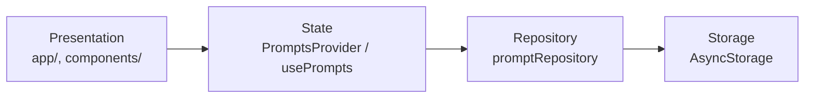
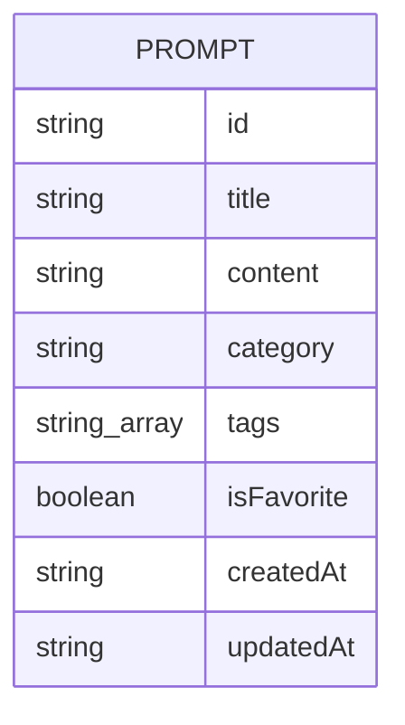

# Architecture Spine — PromptForge

## Design Paradigm

Layered, four layers, one direction of dependency:

**Presentation** (Expo Router screens + components) → **State** (one React Context provider) → **Repository** (one data-access module) → **Storage** (AsyncStorage).



No layer may skip forward or reach backward — a screen never imports AsyncStorage or the Repository directly; it only ever calls `usePrompts()`. This is the one rule the whole spine hangs on: with a single owner at each hand-off, there's no seam where two independently-built screens could diverge on how data is read, written, or shaped.

## Invariants & Rules

### AD-1 — Single storage gateway

- **Binds:** all data access — Create, Edit, Delete, View, Search, Favorite, Category (all FRs in PRD §4).
- **Prevents:** two screens (e.g. Create and Edit) serializing or mutating the stored JSON differently, corrupting or desyncing the library.
- **Rule:** `[ADOPTED]` All AsyncStorage reads/writes go through exactly one module, `lib/promptRepository.ts`. No screen or component imports `@react-native-async-storage/async-storage` directly. The Repository owns id generation, timestamping, and serialization (see Consistency Conventions). On `updatePrompt()`, the Repository sets `updatedAt` to the current time and leaves `createdAt` untouched — `createdAt` is write-once, set only inside `createPrompt()`. Favorite toggling uses a dedicated `toggleFavorite(id)` function, not `updatePrompt()` — it flips `isFavorite` only and does **not** bump `updatedAt` (favoriting isn't editing content). The Repository never re-reads AsyncStorage to compute a write: every write function takes the already-updated array from `PromptsProvider`'s in-memory state (AD-2) and persists it whole. This closes the read-modify-write race a naive "read, mutate, write" Repository would have — there is exactly one in-memory copy of the list during a session, so two rapid mutations (e.g. a delete and a favorite-toggle firing close together) apply sequentially against that one copy, never against two independently-stale reads. Writes are fire-and-forget against AsyncStorage: the in-memory state updates immediately (so the UI never waits on disk I/O), and a failed persist is caught and logged without rolling back the in-memory state — an explicit, accepted trade-off (see Consistency Conventions), not an unspecified gap.

### AD-2 — Single state provider

- **Binds:** Library, Prompt Detail, Create/Edit screens (every surface in EXPERIENCE.md's IA).
- **Prevents:** prop-drilling workarounds or a screen holding its own local copy of the prompt list that drifts from what's actually stored.
- **Rule:** `[ADOPTED]` One `PromptsProvider` (React Context) wraps the app, sourcing all state from the Repository (AD-1) and exposing the prompt list plus CRUD actions through a single `usePrompts()` hook. No screen calls the Repository directly — only through the hook. `usePrompts()` exposes `searchQuery`, `favoritesOnly`, and `categoryFilter` as three independent fields, not one exclusive view-mode enum — the visible list is the result of AND-ing whichever of the three are active (PRD FR-7, FR-10), so Search and either filter always combine rather than override each other. `categoryFilter` is typed `string | null`, where `null` means "no category filter active." This is deliberately distinct from the `Prompt.category` field's own `''` = "no category set" (Consistency Conventions) — the two sentinels must never be conflated, since `categoryFilter: ''` would be a nonsensical "filter to prompts with no category" state that FR-10 never asked for.

### AD-3 — Navigation mirrors the UX IA exactly

- **Binds:** EXPERIENCE.md's Information Architecture (Library, Prompt Detail, Create/Edit Prompt).
- **Prevents:** navigation structure drifting from the one-level-deep modal-stack behavior the UX spine already committed to (no tab bar, no drawer, no nested modals sneaking in as the app grows) — including the subtle version where routes are *coded* as nested even though the UX only ever wants one thing pushed on top of Library at a time.
- **Rule:** `[ADOPTED]` Expo Router file-based routes, all siblings directly under `app/prompt/` — `prompt/[id].tsx` (Detail), `prompt/create.tsx` (Create), `prompt/edit/[id].tsx` (Edit). None of these routes live inside another's folder; sibling routes, not nested ones, is what keeps the *file structure* honest about the *navigation depth* rule. Stack depth from Library is always exactly one: tapping Edit from Detail calls `router.replace()` (not `push()`), swapping Detail for Edit on the stack rather than stacking Edit on top of it.

## Consistency Conventions

| Concern | Convention |
| --- | --- |
| Naming (entities, files, interfaces) | Entity: `Prompt` (matches PRD Glossary and addendum's type exactly). Repository functions: `getAllPrompts()`, `createPrompt()`, `updatePrompt()`, `deletePrompt()`, `toggleFavorite()` (AD-1). Components named identically to DESIGN.md/EXPERIENCE.md — all 10: `PromptCard`, `FAB`, `SearchBar`, `FilterRow`, `CategoryBadge`, `TagChip`, `Toast`, `ConfirmDialog`, `DetailActionRow`, `FormInput`. DESIGN.md's `colors`/`typography`/`rounded`/`spacing` frontmatter tokens are mirrored verbatim, once, in `lib/theme.ts`; NativeWind's Tailwind config extends from that file rather than restating hex values, and components reference the config (e.g. `bg-accent`) rather than hardcoding a hex — the same single-source-of-truth discipline AD-1 applies to data, applied here to visual tokens. |
| Data & formats (ids, dates, error shapes) | `id`: `expo-crypto`'s `randomUUID()`, generated once inside the Repository at create time — never by a screen. `createdAt`: set once inside `createPrompt()`, write-once. `updatedAt`: reset to current time on every `updatePrompt()` call, `createdAt` left untouched (PRD FR-2); `toggleFavorite()` does not touch it (AD-1). Both ISO 8601 strings, matching the addendum's `string` type. `category`: empty string `''` represents "no category set" (resolves the optionality note in the PRD addendum) — distinct from `categoryFilter`'s `null` sentinel (AD-2). The fixed six-value category list (Development, Writing, Research, Marketing, Career, General — PRD FR-9) lives in exactly one place, `lib/categories.ts`, exported as both the runtime array and a derived `Category` union type, so the Create/Edit picker and `FilterRow`'s category chip get compile-time checking against the same source rather than each hard-coding the list or a literal string type. Title/Content required-field validation (FR-1, FR-2) trims whitespace before checking non-empty — a title of `"   "` counts as empty. |
| State & cross-cutting (mutation, errors, hydration) | All mutation flows through `usePrompts()` → Repository → AsyncStorage (AD-1, AD-2), always against the single in-memory list (AD-1) — never a fresh re-read. Storage read/write failures (rare — quota, corrupted JSON) are caught inside the Repository and logged; the in-memory state is not rolled back, and there is no user-facing error state in v1 — an explicit accepted trade-off, not in the PRD's scope, and there's no backend to retry against. Initial hydration: the root layout (`app/_layout.tsx`) keeps the native splash screen visible (`expo-splash-screen`) while `PromptsProvider` performs its one-time initial AsyncStorage read, then reveals the app — no screen ever mounts with an empty/loading prompt list, so no skeleton or spinner is needed to honor EXPERIENCE.md's "loads instantly, no loading state" requirement. If `expo-splash-screen`'s `preventAutoHideAsync()` proves unreliable on stable SDK 56 at implementation time (an open upstream issue exists against a preview build), fall back to a plain conditional render — return `null` until hydration resolves — which still avoids a visible skeleton/spinner. Toast visibility (`components/Toast.tsx`) is local component state, not part of `PromptsProvider` — it's transient UI feedback for one action, not app data, and doesn't belong behind the single state-provider rule (AD-2). |

## Stack

| Name | Version |
| --- | --- |
| Expo SDK | 56 |
| React Native | 0.85 |
| React | 19.2 |
| Expo Router | bundled with Expo SDK 56 (file-based routing, default) |
| NativeWind | `^4.2.6` (stable, Tailwind v3) — pin to the `4.x` caret range explicitly in `package.json` rather than installing `@latest`; v5 (CSS-first config, breaking) is expected to take over the `latest` npm tag on a timeline that doesn't line up with this app's one-day build |
| `@react-native-async-storage/async-storage` | installed via `npx expo install` — Expo resolves the SDK-56-compatible version; do not hand-pin a version from npm directly (community package versioning has drifted from Expo's pinned compatibility in the past) |
| `expo-clipboard` | 56.0.4 |
| `expo-crypto` | 56.0.4 |
| `expo-splash-screen` | installed via `npx expo install` — Expo resolves the SDK-56-compatible version |

## Structural Seed

```text
promptforge/
  app/                       # Expo Router file-based routes (Presentation)
    index.tsx                # Library — search, filter row, card list, FAB
    prompt/[id].tsx           # Prompt Detail
    prompt/create.tsx         # Create (Create/Edit form, create mode)
    prompt/edit/[id].tsx      # Edit (Create/Edit form, edit mode) — sibling of [id].tsx and create.tsx, not nested under either (AD-3)
    _layout.tsx               # Root stack layout, wraps app in PromptsProvider
  components/                # DESIGN.md/EXPERIENCE.md components, 1:1 named — all 10
    PromptCard.tsx
    FAB.tsx
    SearchBar.tsx
    FilterRow.tsx
    CategoryBadge.tsx
    TagChip.tsx
    Toast.tsx
    ConfirmDialog.tsx
    DetailActionRow.tsx        # Prompt Detail's Copy/Favorite/Edit/Delete row
    FormInput.tsx               # Shared text-input used by Title/Content/Tags fields
  lib/
    promptRepository.ts       # Repository — sole AsyncStorage gateway (AD-1)
    PromptsProvider.tsx        # State — Context + usePrompts() hook (AD-2)
    categories.ts              # The fixed 6-value category list + Category type, single source of truth
    theme.ts                   # DESIGN.md's colors/typography/rounded/spacing tokens, mirrored verbatim — the single source NativeWind's config and components both read from
  types/
    prompt.ts                 # Prompt entity type
```



`Prompt` is the only entity — no relationships to diagram. Field shape matches the PRD addendum's TypeScript contract exactly; the Repository is the only code that constructs or mutates a `Prompt`.

## Capability → Architecture Map

| Feature (PRD §4) | Lives in | Governed by |
| --- | --- | --- |
| Prompt Management (FR-1–FR-4) | `app/index.tsx`, `app/prompt/[id].tsx`, `app/prompt/create.tsx`, `app/prompt/edit/[id].tsx` | AD-1, AD-2, AD-3 |
| Search (FR-5) | `components/SearchBar.tsx`, filtered in-memory against `usePrompts()`'s list | AD-2 |
| Favorites (FR-6, FR-7) | `components/FilterRow.tsx`, toggle via `usePrompts()` | AD-1, AD-2 |
| Copy Prompt (FR-8) | `components/PromptCard.tsx`, `app/prompt/[id].tsx`, via `expo-clipboard` | — |
| Prompt Categories (FR-9, FR-10) | `components/CategoryBadge.tsx`, `components/FilterRow.tsx` | AD-1, AD-2 |

## Deferred

- **AI-assisted prompt improvement.** The PRD's vision names "improve" as a pillar alongside organize/search/reuse, but explicitly defers it pending LLM integration (PRD §5) — not dropped, just not architected yet. No AI/network layer exists in this spine's Stack; adding one (an LLM API client, request/response handling, likely a new dependency boundary) is a future spine revision, not a gap in this one.
- **App store submission / production build (EAS Build).** Out of scope for a one-day showcase build — the app runs via Expo Go / a local dev build. Revisit if PromptForge is ever distributed beyond the builder's own device.
- **Dark mode.** Deferred at the UX layer (EXPERIENCE.md Foundation); no architectural work needed until it's prioritized — the color tokens are already structured to add dark variants later.
- **Data export/backup.** Explicit PRD non-goal for v1 (accepted risk); would touch the Repository (AD-1) as its natural extension point if revisited.
- **Automated testing strategy.** Not decided — out of scope for a one-day build. If added later, the layered paradigm (AD-1, AD-2) makes the Repository the natural unit-test seam.
- **Category-based data migration.** If the fixed six-category list ever needs to change, that's a data-shape decision for whoever revisits FR-9 — not fixed here since the PRD keeps the list closed for v1.
